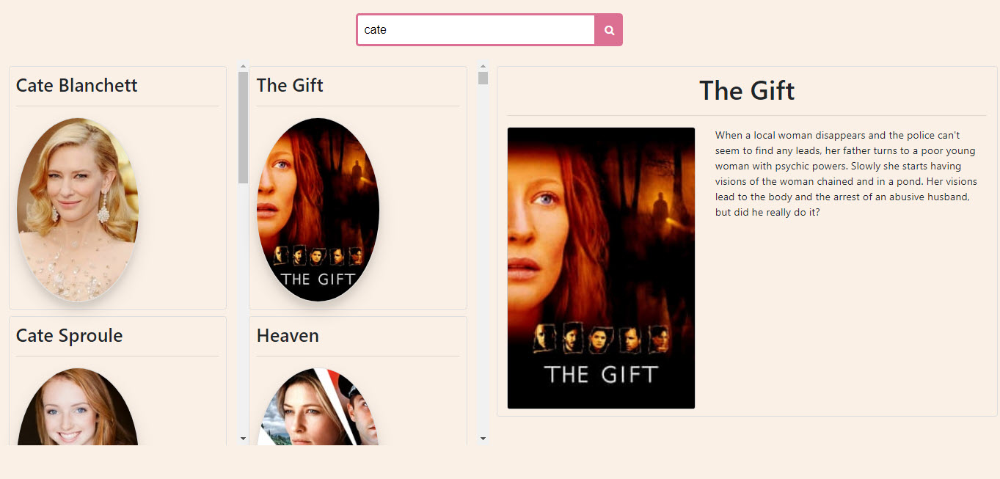

This application fetches the actors/actresses with the given name and/or surname and then you can select a celebrity and see their movies. In addition, after selecting a movie you can see the movie details. An example screenshot is given below:

  
  
  
 The application is built in React.js. Bootstrap 4 and custom CSS is used to style the presentation. 
  
 To run the project you need to get an API key from [here](https://developers.themoviedb.org/3/getting-started/introduction) as the application makes an external API call to TMDb site.

Then update the following line in `ActorMovies.js` with your API key:
```
const apiKey = "your-api-key";
```
Finally, run the following commands in terminal:
```
npm install
npm start
```
The application will launch in the browser.
